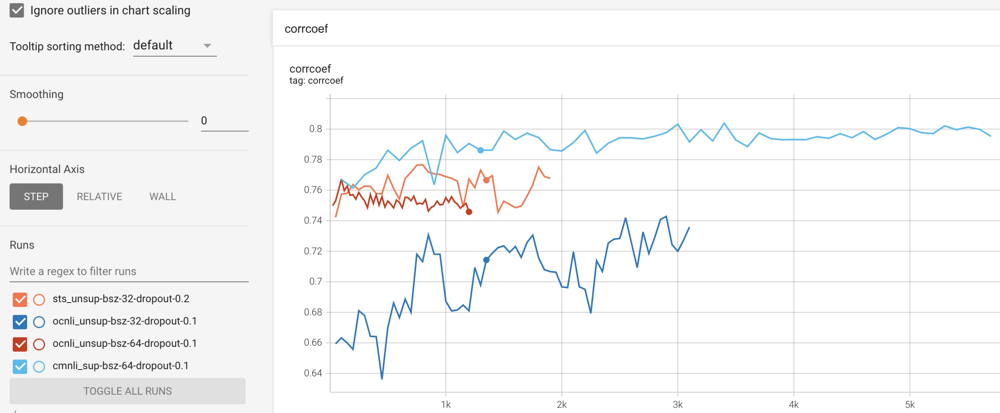

# SimCSE中文语义相似度实验

## 项目描述
SimCSE是一种对比学习方法，在对比学习中，我们希望模型能够学习到文本的语义信息，得到文本的向量表征，拉近正样本之间的距离，拉远负样本之间的距离。
在NLP对比学习中，如何通过数据增强的方式构造正样本，至关重要，而SimCSE则是通过引入Dropout的方式实现正样本的数据增强。
详见论文：[Simple Contrastive Learning of Sentence Embeddings](https://arxiv.org/abs/2104.08821)
和[SimCSE官方代码仓库](https://github.com/princeton-nlp/SimCSE) 。

本项目旨在验证SimCSE模型在中文数据集上的表现，对论文中的有监督训练和无监督训练方法，本项目均在中文数据集上进行了实验，本项目的验证集和测试集
为[STS-B中文数据集](https://github.com/pluto-junzeng/CNSD) ，评价指标为Spearman相关系数，预训练模型为[bert-base-chinese](https://huggingface.co/bert-base-chinese) 。

本项目使用了四种训练集，训练集的来源和用途如下所示(数据处理可参考脚本make_train_data.py)：
- cmnli_sup: 从[Chinese-MNLI](https://github.com/pluto-junzeng/CNSD) 数据集中，提取<anchor, entailment, contradiction>三元组，
最终构成包含122548条数据的训练集。用于有监督训练。详见cmnli_sup_train_data.csv。
- ocnli_sup: 从[OCNLI](https://github.com/CLUEbenchmark/OCNLI) 数据集中，提取<anchor, entailment, contradiction>三元组，
最终构成包含7785条数据的训练集。用于有监督训练。详见ocnli_sup_train_data.csv
- stsb_unsup: 从[STS-B中文训练集](https://github.com/pluto-junzeng/CNSD) 中，选出6067个文本，用于无监督训练 。
详见sts_unsup_train_data.txt。
- ocnli_unsup: 从[OCNLI](https://github.com/CLUEbenchmark/OCNLI) 数据集中，随机选择10000个文本，用于无监督训练。
详见ocnli_unsup_train_data.txt。


### 总体实验效果对比
在中文STS-B数据集上，有监督训练和无监督训练的实验效果如下表：

| 训练集 |lr  | b_size  | dropout |验证集上的得分| 测试集上的得分|
|----|  ----  | ----  |  ----  | ----  | ----  |
|bert-base-chinese| - | - |-|0.422  |0.342  |
|stsb_unsup| 3e-5  | 32 |0.2|0.777 |0.740 |
|ocnli_unsup| 3e-5  | 32 |0.1|0.743  |0.655  |
|cmnli_sup| 3e-5  | 64 |0.1|__0.804__   |__0.784__   |
|ocnli_sup| 3e-5  | 64 |0.1|0.767  |0.725  |

更多模型的实验结果可以参考苏剑林的博客[中文任务还是SOTA吗？我们给SimCSE补充了一些实验](https://kexue.fm/archives/8348)

通过上表可以得到如下结论：
- 通过MLM任务训练的BERT模型，对文本语义的建模效果不佳。
- 即使是SimCSE的无监督训练，对Bert的MLM任务也具备压倒性优势，经过stsb_unsup训练，能够获得0.74的得分。
- SimCSE的有监督训练，由于引入了更高质量的正例与负例，相比无监督训练，效果显著提高。
- 使用不同的训练集，得到的模型的指标差异较大，可以看到训练集的质量或者规模，对有监督和无监督训练都至关重要。

## 项目结构
- data：存放训练数据
    - STS-B：STS-B数据集
        - dev.txt：STS-B验证集
        - test.txt：STS-B测试集
        - train.txt：STS-B训练集
    - cmnli_sup_train_data.csv:数量为122548的有监督训练集
    - ocnli_sup_train_data.csv:数量为7785的有监督训练集
    - ocnli_unsup_train_data.txt:数量为10000的无监督训练集
    - stsb_unsup_train_data.txt:数量为6067的无监督训练集
- output:输出目录 
-script:存放运行脚本
    - run_sup_train.sh:有监督训练脚本
    - run_unsup_train.sh:无监督训练
- pretrain_model：预训练模型存放位置
- dataset.py
- eval_bert.py:测试bert模型的指标
- make_train_data.py:构造训练集
- model.py：模型代码，包含有监督和无监督损失函数的计算方式
- train_sts.py:训练代码
- statistics.py:统计数据的长度分布


## 使用方法
### Quick Start
安装环境：
```
pip install -r requirements.txt
```

下载训练模型[bert-base-chinese](https://huggingface.co/bert-base-chinese) ，存放到pretrain_model目录下。
测试bert-base-chinese的效果：
```
python eval_bert.py
```

无监督训练，运行脚本(通过--train_file指定训练集)：
```
bash script/run_unsup_train.sh
```
有监督训练，运行脚本：
```
bash script/run_sup_train.sh
```

## 实验
### 无监督实验

stsb_unsup训练集：

| 训练集 |lr  | b_size  | dropout |验证集上的得分| 测试集上的得分|
|----|  ----  | ----  |  ----  | ----  | ----  |
|stsb_unsup| 3e-5  | 32 |0.1|0.769 |0.728 |
|stsb_unsup| 3e-5  | 32 |0.2|__0.777__ |__0.740__ |
|stsb_unsup| 3e-5  | 32 |0.3|0.758 |0.713 |
|stsb_unsup| 3e-5  | 64 |0.1|0.758 |0.720 |
|stsb_unsup| 3e-5  | 64 |0.2|0.763 |0.728 |
|stsb_unsup| 3e-5  | 64 |0.3|0.759 |0.697 |
|stsb_unsup| 3e-5  | 128 |0.1|0.755 |0.716 |
|stsb_unsup| 3e-5  | 128 |0.2|0.761 |0.716 |
|stsb_unsup| 3e-5  | 128 |0.3|0.759 |0.710 |

ocnli_unsup训练集：

| 训练集 |lr  | b_size  | dropout |验证集上的得分| 测试集上的得分|
|----|  ----  | ----  |  ----  | ----  | ----  |
|ocnli_unsup| 3e-5  | 32 |0.1|__0.743__  |__0.655__  |
|ocnli_unsup| 3e-5  | 32 |0.2|0.718 |0.631 |
|ocnli_unsup| 3e-5  | 32 |0.3|0.703  |0.637  |
|ocnli_unsup| 3e-5  | 64 |0.1|0.726  |0.638  |
|ocnli_unsup| 3e-5  | 64 |0.2|0.713  |0.639  |
|ocnli_unsup| 3e-5  | 64 |0.3|0.703  |0.639  |
|ocnli_unsup| 3e-5  | 128 |0.1|0.704  |0.626  |
|ocnli_unsup| 3e-5  | 128 |0.2|0.700  |0.631  |
|ocnli_unsup| 3e-5  | 128 |0.3|0.695  |0.630  |

通过上述实验结果可以看到：
- 在batch size相同的情况下，在大部分情况下，dropout取0.2是较好的选择。
- batch size取32的时候，模型在测试集上的表现最好，有点出乎意料。至少该实验结果看来，batch size不一定是越大越好。
- stsb_unsup训练出来的模型，效果远好于ocnli_unsup，笔者猜想是因为stsb训练集和验证集、测试集的数据分布更接近导致的。

### 有监督实验
| 训练集 |lr  | b_size  | dropout |验证集上的得分| 测试集上的得分|
|----|  ----  | ----  |  ----  | ----  | ----  |
|ocnli_sup| 3e-5  | 32 |0.1|0.756  |0.723  |
|ocnli_sup| 3e-5  | 64 |0.1|0.767  |0.725  |
|cmnli_sup| 3e-5  | 32 |0.1|0.800   |0.770   |
|cmnli_sup| 3e-5  | 64 |0.1|__0.804__   |__0.784__   |

通过上述实验结果可以看到：
- 有监督训练的效果显著优于无监督训练。
- cmnli_sup训练出来的模型，效果远好于ocnli_sup，增大数据量可以有效提高模型的训练效果。


### 训练过程
训练过程中，各种训练策略在验证集上的得分变化曲线：


从上图可以看到：
- 有监督训练的收敛速度远快于无监督训练。
- 在无监督训练中，训练集的质量对训练效果影响非常大，由于sts-b训练集的分布与验证集较为接近，所以收敛速度和训练效果都远好于ocnli_unsup。


## REFERENCE
- https://github.com/yangjianxin1/SimCSE
- https://arxiv.org/pdf/2104.08821.pdf
- https://kexue.fm/archives/8348
- https://github.com/bojone/SimCSE


